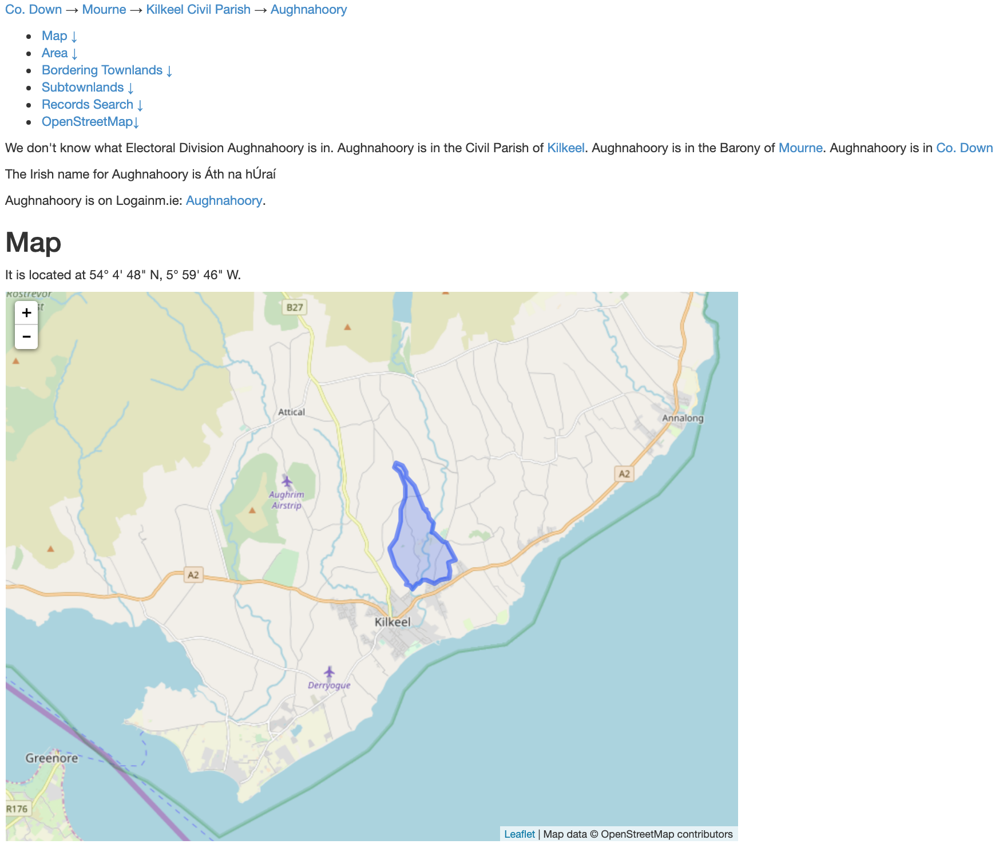

The National Archives of Ireland has made both the 1901 and 1911 Census of Ireland publically available on their [website](http://www.census.nationalarchives.ie/).  In both censuses, each household return is indexed by townland or street.  By combining census data with townland boundary data avilable on [townlands.ie](https://www.townlands.ie/), we can create maps that can help us visualize the 1901 and 1911 censuses.

## Getting Census Data for a Particular Region

The census website has a webpage for each household return.  Here is an [example](http://www.census.nationalarchives.ie/pages/1901/Down/Kilkeel/Aughnahoory/1234778/):

This household return is indexed by house number (1), townland or street (Aughnahoory), district electoral division or DED (Kilkeel), county (Down), and year (1901).  The table displays all and only the residents of house 1 in Aughnahoory, Kilkeel, County Down, in the year 1901.  But what if we wanted a table containing all of the household returns in the DED of Kilkeel for the year 1901, each indexed by townland and by house number?

We can use [Beautiful Soup](https://www.crummy.com/software/BeautifulSoup/bs4/doc/) to create such a table.  By feeding [this Jupyter Notebook](https://github.com/nrvanwyck/DS-Unit-1-Sprint-5-Data-Storytelling-Blog-Post/blob/master/Web-Scraping%201901%20and%201911%20Census%20of%20Ireland%20by%20DED.ipynb) the url for a particular DED in a particular year, we can create a giant csv containing all of the census data for that DED in that year.  For instance, when we set the seed url to http://www.census.nationalarchives.ie/pages/1901/Down/Kilkeel/ and run the entire Jupyter Notebook, we wind up with a csv entitled 1901_Down_Kilkeel_raw.csv, containing all of the census information for Kilkeel in 1901.

## My Data Set

I chose to work the 1911 census data for twelve DEDs roughly centered around Mount Slemish between the towns of Ballymena and Larne in County Antrim:

Red Bay
Broughshane
Glenravel
Newtown Crommelin
Ballyclug
Glenwherry
Slemish
Ardclinis
Glenarm
Glencloy
Carncastle
Longmore

eleven DEDs covering the coast between the Mourne Mountains and the Irish Sea in County Down:

Bryansford
Fofanny
Maghera
Newcastle
Ballykeel
Kilkeel
Mullartown
Greencastle
Mourne Park
Killowen
Rosstrevor

and twenty-two DEDs located on the east side of Lower Lough Erne, north of the town of Enniskillen, along the border of County Fermanagh and County Tyrone:

Ballycassidy
Ballydoolagh
Castle Coole
Lisbellaw
Ballyreagh
Clabby
Imeroo
Newporton
Tempo
Magheraculmoney
Ballinamallard
Irvinestown
Lisnarick
Milltown
Rockfield or Killadeas
Drumharvey
Kilskeery
Moorfield
Trillick
Dromore
Tullyclunagh
Carryglass

Using the raw csvs obtained with Beautiful Soup, I've created csvs with the combined census data for all of the above listed DEDs for both the [1901 census](https://github.com/nrvanwyck/DS-Unit-1-Sprint-5-Data-Storytelling-Blog-Post/blob/master/census_1901_combined.csv) and the [1911 census](https://github.com/nrvanwyck/DS-Unit-1-Sprint-5-Data-Storytelling-Blog-Post/blob/master/census_1911_combined.csv).  The DED and Townland or Street columns of these two csv files have already been cleaned to standardize spelling across the two censuses.  Further, the csv for the 1911 census contains census data for the village of Rostrevor that I have personally transcribed from images of household returns; the National Archives was missing transcriptions of those returns.

## Combining Census Data and Townland Data

Each townland has its own webpage on townlands.ie; here is [an example](https://www.townlands.ie/down/mourne/kilkeel/aughnahoory/):

Boundary data for every townland on townlands.ie can be downloaded directly from the site's [download page](https://www.townlands.ie/page/download/).  Using that comprehensive boundary data, I created a [GeoJSON file](https://github.com/nrvanwyck/DS-Unit-1-Sprint-5-Data-Storytelling-Blog-Post/blob/master/townland_boundaries_from_townlands_ie.geojson) that is limited to boundaries for each townland in the forty-five DEDs listed above; I've edited the boundary data for the townlands of Warren (spanning the parishes of Ardclinis and Layd) and Drumleckney (in the parish of Racavan), both in County Antrim, because each of those townlands had been split into two on townlands.ie when I downloaded the boundary data.

In order to integrate the census data and the townland boundary data, we have to match each townland or street in the census data to a townland on townlands.ie.  The census website groups townlands by DED, but not by parish; townlands.ie groups these particular townlands by parish but not by DED.  That fact, coupled with the fact that different townlands within a county can share the same name, makes it difficult to merge the two datasets, and this problem is made worse by variations in spelling across the two datasets.  On top of that, while most household returns are categorized by townland, others are categorized by street, village, town, or harbour; the census records do not always give the townland in which these streets, villages, towns, or harbours are located, and some of these locations span more than one townland.

[This csv](https://github.com/nrvanwyck/DS-Unit-1-Sprint-5-Data-Storytelling-Blog-Post/blob/master/townland_or_street_to_townlands_ie_urls.csv) is my attempt to map each standardized place name in the cleaned census data to a url on townlands.ie; given the aforementioned difficulty of mapping streets, villages, towns, and harbours onto towlands, the csv likely contains some errors, and certainly loses some accuracy in its simplifications.

